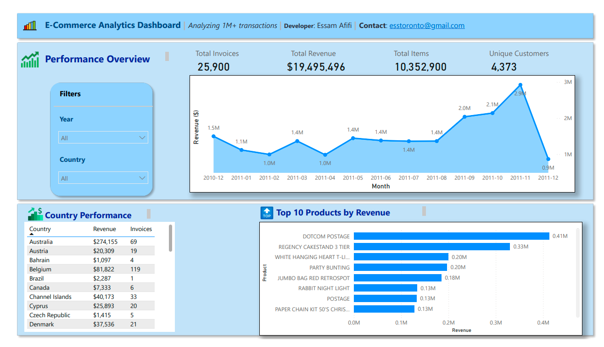

# 🛍️ E-Commerce Power BI Dashboard

This Power BI dashboard analyzes over **1 million eCommerce transactions** and replicates the functionality and feel of an interactive Python Streamlit dashboard — built for **insights at speed** and **enterprise readiness**.

> 📊 Designed for clarity, performance, and quick decision-making.

---

## 📸 Preview

---

## 📁 Project Files

| File Name                     | Description                                          |
|------------------------------|------------------------------------------------------|
| `eCommercePowerBiDB.pbix`    | Complete Power BI report with embedded data         |
| `eCommercePowerBiDB.pbit`    | Power BI **template** file (no data) for reuse      |
| `eCommercePowerBiDB.pdf`     | Static PDF version of the dashboard                 |
| `eCommerceDb-PwerBi.png`     | Screenshot of the dashboard                         |

---

## ✨ Features

- ✅ **Top 10 Products** by revenue with ranked visual
- 🌍 **Country Performance** breakdown with filters
- 📆 Dynamic filtering by **Year** and **Country**
- 📊 **KPI Cards** for total revenue, average basket size, and more
- 🎨 Clean, professional design with icon-enhanced summaries
- 📁 Built entirely in **Power BI Desktop** — no code or Python needed

---

## 🌐 Python Dashboard Reference

This Power BI dashboard was inspired by a fully interactive version built with **Python and Streamlit**, using:
- `Plotly` for charts
- `Seaborn` for visual summaries
- `PyCountry` for map region handling

🧪 You can explore that interactive version here:  
🔗 [Live Python Dashboard on Streamlit](https://ecom-dashboard-analytics-4rgfidzx3p9dhpbgrexhpv.streamlit.app/)

🎥 **Watch the 1-minute demo video** below:

> Click the image above to watch a quick walkthrough of the dashboard, highlighting:
> - Raw data loading
> - Top 10 Products view
> - Country-level metrics with map and filters
> - Excel export for offline reporting

---

## 🔧 Tools Used

- [Power BI Desktop](https://powerbi.microsoft.com/)
- DAX (Data Analysis Expressions)
- Relational Data Modeling
- Report Theming and Design
- GitHub for version control and sharing

---

## 💡 Use Cases

- Business/Product Analytics
- Sales Performance Monitoring
- eCommerce Dashboarding
- KPI Reporting and Executive Summaries

---

## 📬 Contact

**Interested in building custom analytics tools or dashboards?**  
Let's connect and build something powerful together.

📧 Email:esstoronto@gmail.com  
🌍 LinkedIn: [Essam Afifi](https://www.linkedin.com/in/essam-afifi-a38a3a362/)
 

